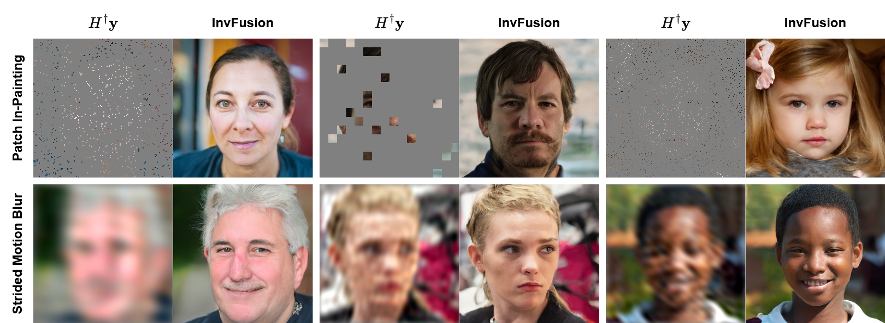

# InvFusion: Bridging Supervised and Zero-shot Diffusion for Inverse Problems<br><sub>Official PyTorch implementation</sub>



[Noam Elata*](https://noamelata.github.io/)*, [Hyungjin Chung*](https://hyungjin-chung.github.io/)*, [Jong Chul Ye](https://bispl.weebly.com/professor.html), [Tomer Michali](https://tomer.net.technion.ac.il/), [Michael Elad](https://elad.cs.technion.ac.il/)<br>
  https://arxiv.org/pdf/2504.01689<br>

### Abstract
*Diffusion Models have demonstrated remarkable capabilities in handling inverse problems, offering high-quality posterior-sampling-based solutions. Despite significant advances, a fundamental trade-off persists, regarding the way the conditioned synthesis is employed: Training-based methods achieve high quality results, while zero-shot approaches trade this with flexibility. This work introduces a framework that combines the best of both worlds -- the strong performance of supervised approaches and the flexibility of zero-shot methods. This is achieved through a novel architectural design that seamlessly integrates the degradation operator directly into the denoiser. In each block, our proposed architecture applies the degradation operator on the network activations and conditions the output using the attention mechanism, enabling adaptation to diverse degradation scenarios while maintaining high performance. Our work demonstrates the versatility of the proposed architecture, operating as a general MMSE estimator, a posterior sampler, or a Neural Posterior Principal Component estimator. This flexibility enables a wide range of downstream tasks, highlighting the broad applicability of our framework. The proposed modification of the denoiser network offers a versatile, accurate, and computationally efficient solution, demonstrating the advantages of dedicated network architectures for complex inverse problems. Experimental results on the FFHQ and ImageNet datasets demonstrate state-of-the-art posterior-sampling performance, surpassing both training-based and zero-shot alternatives.*

\* Equal contribution

## Prerequisites

Please complete the following steps

1. Install pytorch with the appropriate hardware and the following packages:
    ```
    click Pillow psutil requests scipy tqdm diffusers accelerate 
    ```
    Install [`natten`](https://www.shi-labs.com/natten/) fitting the appropriate hardware and pytorch version.

    `wandb` is optional and is used for logging.

2. Download the relevant datasets and place them in the `data/` folder. 

3. pre-compute the reference statistics for your dataset.
```bash
torchrun --standalone --nproc_per_node=<num gpus> calculate_metrics.py ref --data datautils.<dataset name>.<dataset class> --dest dataset-refs/<ref name>.pkl
```

## Inference

### Model checkpoints coming soon!

To calculate metrics for a trained model, please run:

```bash
torchrun --standalone --nproc_per_node=<num gpus> calculate_metrics.py  gen   \
      --net <path to pretrained model>                                        \
      --data datautils.<dataset name>.<dataset class>                         \
      --degradation degradation.<degradation to test>                         \
      --ref dataset-refs/<ref name>.pkl                                       \
      [--outdir <optional path for saving outputs>]
```

list of available degradations:
 - `degradation.RandomDegradation`
 - `degradation.MotionBlur`
 - `degradation.MissingPatches`
 - `degradation.MatrixDegradation`
 - `degradation.Box`

For example, the following evaluates FID and PSNR for Motion Blur restoration on ImageNet $64\times 64$ with 8 GPUs.
```bash
torchrun --standalone --nproc_per_node=8 calculate_metrics.py  gen  \
      --net checkpoints/imagenet/checkpoint.pt                      \
      --data datautils.imagenet.ImageNet64                          \
      --degradation degradation.MotionBlur                          \
      --ref dataset-refs/imagenet-10k-64.pkl                        \
      --cfg 2.0                                                     \
      --metrics fid,psnr
```

## Train

```bash
torchrun --standalone --nproc_per_node=<num gpus> train.py    \
      --data-class datautils.<dataset name>.<dataset class>   \
      --ref-path dataset-refs/<ref name>.pkl                  \
      --degradation degradation.RandomDegradation             \
      --name invfusion
```
Remove the `--degradation` argument to train an unconditional model.
Add `--blind-train` argument to train a degradation-blind model.
Use `python train.py -h` to get the list of available arguments.

## Citation

```bibtex
@article{elata2025invfusion,
   title    = {InvFusion: Bridging Supervised and Zero-shot Diffusion for Inverse Problems},
   author   = {Noam Elata and Hyungjin Chung and Jong Chul Ye and Tomer Michaeli and Michael Elad},
   journal  = {arXiv preprint arXiv:2504.01689},
   year     = {2025}
}
```

## Acknowledgments and References

This code uses implementations from [EDM2](https://github.com/NVlabs/edm2), [EDM](https://github.com/NVlabs/edm), [HDiT](https://github.com/crowsonkb/k-diffusion) and [MotionBlur](https://github.com/LeviBorodenko/motionblur). Please consider also citing:

```bibtex
@inproceedings{Karras2024edm2,
   title     = {Analyzing and Improving the Training Dynamics of Diffusion Models},
   author    = {Tero Karras and Miika Aittala and Jaakko Lehtinen and Janne Hellsten and Timo Aila and Samuli Laine},
   booktitle = {Proc. CVPR},
   year      = {2024},
}
@inproceedings{Karras2022edm,
   author    = {Tero Karras and Miika Aittala and Timo Aila and Samuli Laine},
   title     = {Elucidating the Design Space of Diffusion-Based Generative Models},
   booktitle = {Proc. NeurIPS},
   year      = {2022}
}
@InProceedings{crowson2024hourglass,
   title     = {Scalable High-Resolution Pixel-Space Image Synthesis with Hourglass Diffusion Transformers},
   author    = {Crowson, Katherine and Baumann, Stefan Andreas and Birch, Alex and Abraham, Tanishq Mathew and Kaplan, Daniel Z and Shippole, Enrico},
   booktitle = {Proceedings of the 41st International Conference on Machine Learning},
   pages     = {9550--9575},
   year      = {2024},
   editor    = {Salakhutdinov, Ruslan and Kolter, Zico and Heller, Katherine and Weller, Adrian and Oliver, Nuria and Scarlett, Jonathan and Berkenkamp, Felix},
   volume    = {235},
   series    = {Proceedings of Machine Learning Research},
   month     = {21--27 Jul},
   publisher = {PMLR},
   pdf       = {https://raw.githubusercontent.com/mlresearch/v235/main/assets/crowson24a/crowson24a.pdf},
   url       = {https://proceedings.mlr.press/v235/crowson24a.html},
   abstract  = {We present the Hourglass Diffusion Transformer (HDiT), an image-generative model that exhibits linear scaling with pixel count, supporting training at high resolution (e.g. $1024 \times 1024$) directly in pixel-space. Building on the Transformer architecture, which is known to scale to billions of parameters, it bridges the gap between the efficiency of convolutional U-Nets and the scalability of Transformers. HDiT trains successfully without typical high-resolution training techniques such as multiscale architectures, latent autoencoders or self-conditioning. We demonstrate that HDiT performs competitively with existing models on ImageNet $256^2$, and sets a new state-of-the-art for diffusion models on FFHQ-$1024^2$. Code is available at https://github.com/crowsonkb/k-diffusion.}
}
```